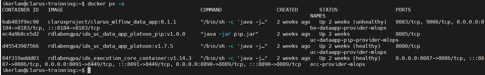

# true-connector-trainning

This repository contains the docker-compose and the configuration files needed to deploy a TrueConnector in the trainning platform.
ENG TrueConnector is used, execution core and usage control provided by ENG haven´t been modified. Data App has been modified. This Data App has been extended with features that allow the acces to postgres database and MinIO server. 

## Requirements

- Linux machine with Docker version 23.0.5 or above
- Linux machine with Docker-compose version 1.29.2 or above
  
## How to deploy

- Clone this repository.Move to the folder clarus_edge_deploy and and configure and execute following next subsections.
### -> Create certificate for DAPS component
If you are using Clarus Dataspace DAPS. You need to create a certificate for the TRueConnector used by the AIToolkit and configure some settings. DAPS needs a certificate for each participant. The following steps and examples describe the sequence of operations. The names in italics and bold are only as examples.

1.	Create certificate for sharing with DAPS

   

    openssl req -x509 -nodes -newkey rsa:2048 -keyout ***xx-daps-train***.key -out ***xx-daps-train***.cert -sha256 -days 365 -subj "/C=***ES***/ST=***Spain***/L=***GI***/O=***IKERLAN***/OU=***IPD***/CN=***xx-daps-train-cn***” -addtext "subjectAltName = DNS:***your public DNS or IP***" 
    

2.	Send ***xx-daps-train***.cert to DAPS operator

3.	Generate a .p12 using the key/cert pair you created at step 1, (set a password when prompted) and save it at ecc_cert folder
 
    openssl pkcs12 -export -out ***xx-daps-train***.p12 -inkey ***xx-daps-train***.key -in ***xx-daps-train***.cert -name ***preferred_name***
    

4.	Download public certificate (mvds-clarus.eu.crt) from DAPS operator ( http://daps.mvds-clarus.eu ) 

5.	Import certificates to the truststore at ecc_cert

    
    keytool -import -v -trustcacerts -alias mvds-clarus.eu -file mvds-clarus.eu.crt -keystore truststoreEcc.jks -keypass changeit -storepass allpassword 

    keytool -import -v -trustcacerts -alias ***xx-daps-train*** -file ***xx-daps-train***.cert -keystore truststoreEcc.jks -keypass changeit -storepass allpassword 
    

6.	Edit and update. env properties at Clarus edge services folder as follow:
    
    CACHE_TOKEN=true 

    FETCH_TOKEN_ON_STARTUP=true

    CONSUMER_DAPS_KEYSTORE_NAME= ***xx-daps-train***.p12

    CONSUMER _DAPS_KEYSTORE_PASSWORD= ***password_in_step3***

    CONSUMER _DAPS_KEYSTORE_ALIAS= ***preferred_name_in_step3***
    

7.	Edit and update application-docker.properties at ecc_resources folder as follows:

    ```
    application.isEnabledDapsInteraction=true  
    application.extendedTokenValidation=false 
    application.dapsUrl=https://daps.mvds-clarus.eu/auth/token  
    application.dapsJWKSUrl=https://daps.mvds-clarus.eu/auth/jwks.json 
    ```

### -> Create certificate for data exchange with other TrueConnector
The TRueConnector used by the AIToolkit uses TLS certificates to provide or consume data to/from  TRueConnector deployed at edge. It is needed to create a TLS certificate for TrueConnector and import in the truststore the public key of the TRueConnector at edge. Move to the ecc_folder and recreate certificates. The following steps and examples describe the sequence of operations.  The names in italics and bold are only as examples.

1.	Create public/private key in keystore

    
    keytool -genkey -alias ***xx-tc-train*** -keyalg RSA -keypass changeit -storepass changeit -keystore ssl-server.jks -ext SAN=ip:***your public IP***, dns:uc-dataapp-provider,dns:ecc-provider-mlops,dns:be-dataapp-provider-mlops 
    
2.	Export certificate

    
    keytool -export -alias ***xx-tc-train***  -storepass changeit  -file ***xx-tc-train***.cer -keystore ssl-server.jks 
    

3.	Import own certificate in truststore

    
    keytool -import -v -trustcacerts -alias ***xx-tc-train*** -file ***xx-tc-train***.cer -keystore truststoreEcc.jks -keypass changeit -storepass allpassword 
    

4.	Edit and update. env properties at Clarus edge services folder with the Alias certificate you have used

    
    ALIAS= ***xx-tc-train*** 
    

5.	Get TRueConnector public certificate from edge TrueConnector 

6.	Import in your truststore
    
    keytool -import -v -trustcacerts -alias ***xx-tc-edge*** -file ***xx-tc-edge***.cer -keystore truststoreEcc.jks -keypass changeit -storepass allpassword
    

### -> Configure enviroment properties

- Clone this repository.
- Move to the folder true-connector-trainning
- Edit .env file and configure the access to postgres and MinIO server
  ```
    # minio configuration
    MINIO_URI=http://XXX.XXX.XXX.XXX:9000
    MINIO_USERNAME=user
    MINIO_PASSWORD=password

    # postgres configuration
    POSTGRES_IP=XXX.XXX.XXX.XXX
    POSTGRES_PORT=30006
    POSTGRES_USER="mlflow"
    POSTGRES_PASSWORD="mlflow"
    POSTGRES_DATABASE="mlflow"
  
  ```

### -> Execute services

- Login in Dockerhub using the clarusproject credentials provided by ENG
    ```
    docker login -username=clarusproject
    ```
- Create a volume for the data app component the first time the TRueConnector is deployed.
    ```
    ./prepopulate_be_dataapp_data_provider.sh
    ```
- Execute docker-compose file
    ```
    docker-compose up -d
    ```
- Once docker-compose is finished, all the containers shall be up and running. To check it, write in terminal type in terminal
    ```
    docker ps -a
    ```
You shall see next services up:



## How to use

TrueConnector is ready to be used by the aitoolkit experiments.
Airflow dags will use this connector to read data from pilots.
Airflow dags will use this connector to register desired experiments and to offer them to pilots.

## TrueConnector documentation
A complete description of TrueConnector can be found [here](https://github.com/Engineering-Research-and-Development/true-connector)